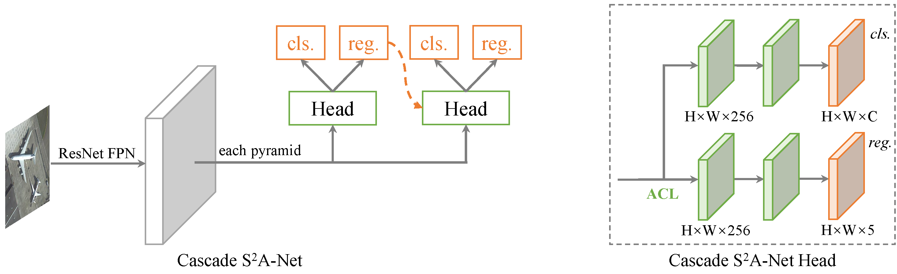

## Cascade S2A-Net

Cascade S2A-Net (CS2A-Net) can be regarded as a generalized S2A-Net. 
It consists of several detection heads, and each head contains an Alignment Convolution and two subnetworks, _.i.e_, _cls_ and _reg_.
The overall archetecture of CS2A-Net is shown below.

The difference between CS2A-Net and S2A-Net is:
* CS2A-Net head aligns features first by an Alignment Convolution Layer (ACL), and produce _cls_score_ and _bbox_pred_ later.
While the FAM in S2A-Net does clssification and regression first, then produces aligned features.

* CS2A-Net aligns features in each stage, while feature alignment in S2A-Net is only appeared at the end of FAM. 
So even the one stage version of CS2A-Net, _.i.e_, CS2A-Net-1s can produce aligned features.
